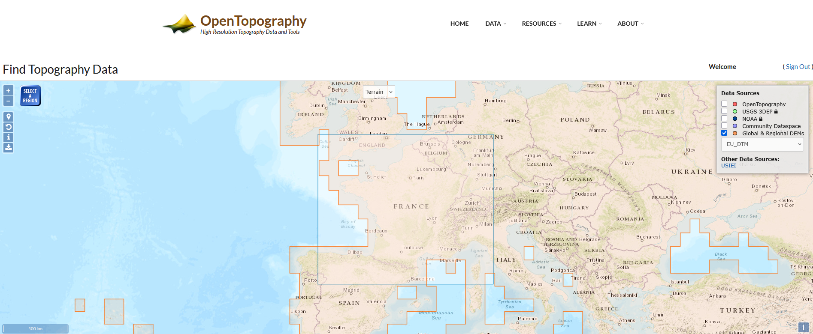
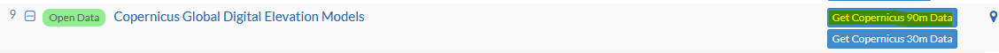
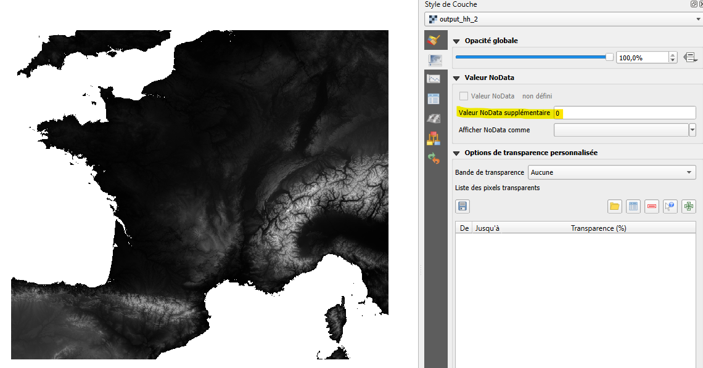
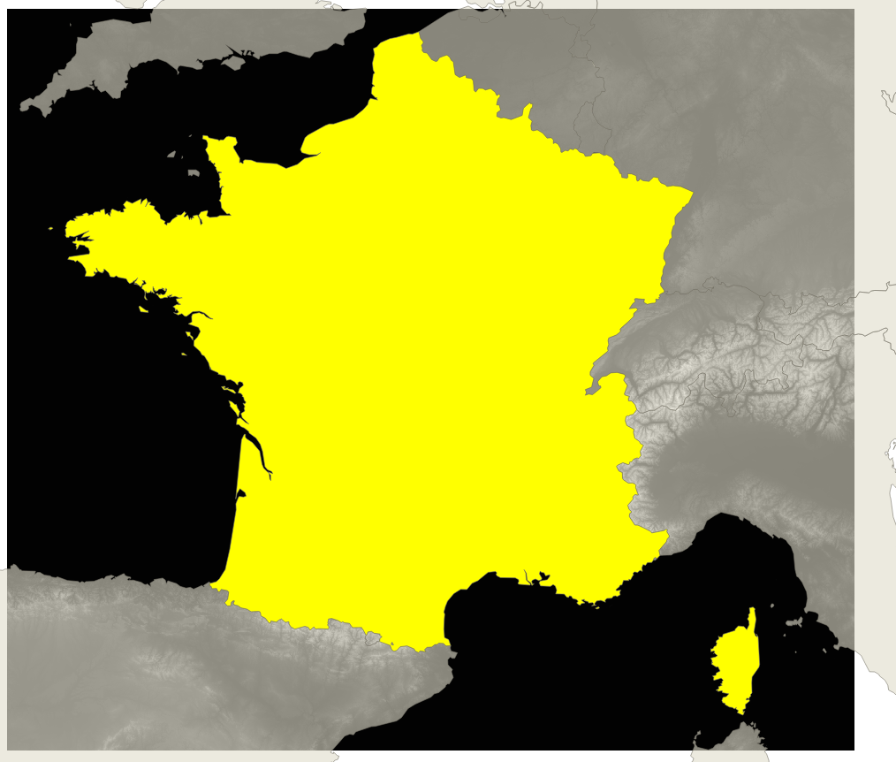
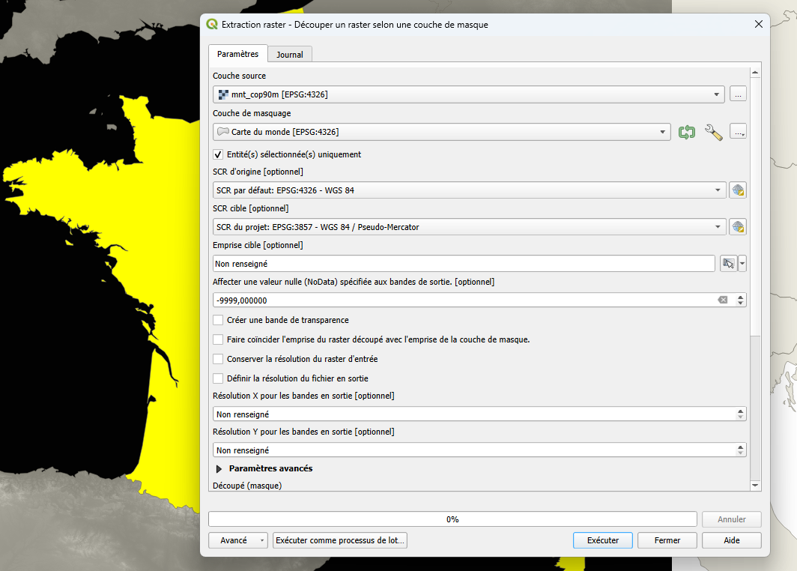
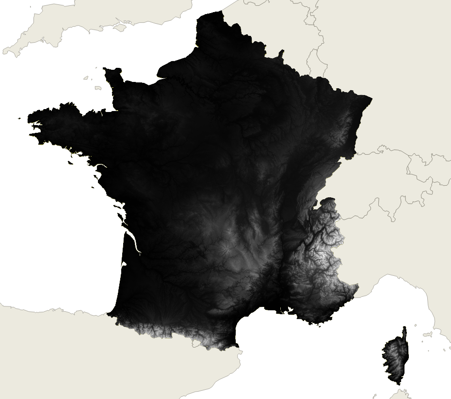
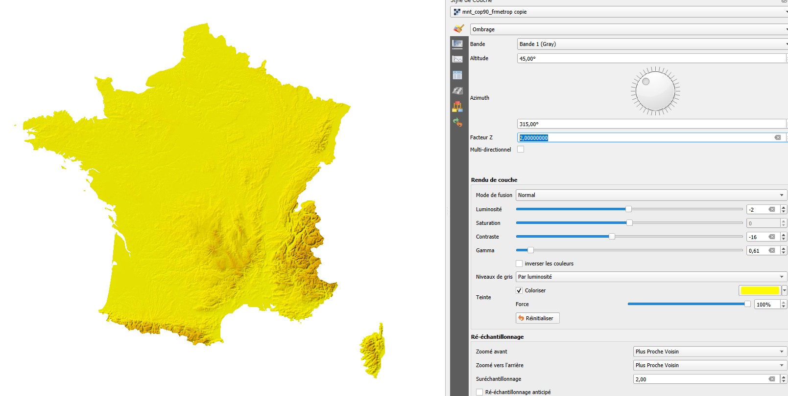

---
authors:
  - thomas
categories:
  - QGIS
date:
  created: 2025-07-15
---
# Tutoriel - Tour de France

Apprendre par le divertissement. Parce que le sport n'est pas qu'une affaire de canapé ou de grimpage de col une fois l'an pour se faire mal aux guiboles.
Vive le 🚲 💛, vive la vélomatique 😄

<!-- more -->

## Jouons avec le Modèle numérique de terrain

Cette année 2025, le tour est intra héxagone. Amusons-nous à créer notre fond de plan.

### Les ingrédients : 

- un modèle numérique de terrain
- un vecteur de la France métropolitaine
- une touche de symbologie

#### Pour le MNT

Je suis passé par le site [Open Topography](https://portal.opentopography.org/) qui ne nécessite pas forcément d'avoir un compte et qui permet de télécharger 
des MNT Open Data. Je me suis tourné vers les données du programme Copernicus.

On choisi la source. Pour l'échelle, je me contente d'un MNT de 90m de pas, ça semble être le bon compromis. Il faut valider le formulaire tel quel (peut-être en renseignant le mail si vous ne disposez pas de compte).

Le *job* est assez rapide 61s. On récupère une archive de 703.8 Mo. C'est plus long à télécharger qu'à produire !

???+ info "Citation pour le jeux de données"

    European Space Agency (2024).  <i>Copernicus Global Digital Elevation Model</i>.  Distributed by OpenTopography.  https://doi.org/10.5069/G9028PQB. Accessed 2025-07-15

    **Use License:** © DLR e.V. 2010-2014 and © Airbus Defence and Space GmbH 2014-2018 provided under COPERNICUS by the European Union and ESA; all rights reserved. 

#### Pour le vecteur 

de la France métropolitaine, je ne vais pas aller plus loin que le *eastter egg* de QGIS, en tapant **world** dans la barre des coordonnées. Et hop, les pays du monde sont là ! géomagie à la carte 🗺️

Je check mes données et hooooo bonne surprise ! bonne surprise ! Elles sont toutes dans le même SRC, c'est chouette on va pouvoir faire un belle découpe directement.

Allez, allez, la découpe n'attend pas. Je sélectionne la France et hop, menu > raster > extraction > Découper un raster selon une couche de masque

On dit merci GDAL au passage ! Et voilà le travail : 

!!! note "Résultat"

    === "MNT / QGIS"

        

        Le "0" c'est juste pour le fun et un joli affichage, en plus faudrait mettre -9999 pour ne pas perdre de la donnée ...

    === "Sélection"

        

        Après avoir chargé la couche vectorielle *world* bien entendu.

    === "On découpe"

        
    
    === "Wouahou"

        

#### La touche de symbologie

Sur la couche découpée, on procéde en deux étapes.

- on va colorisé avec une pseudo couleur à bande unique

Pour aller plus vite, voici un `qml` pour dépanner, [style_color_ramp1.qml](../../static/style_color_ramp1.qml){:download="style_color_ramp1.qml"}

- sur une couche dupliquée (positionnée sous la première), on va styliser avec la fonction ombrage du panneau style de couche

