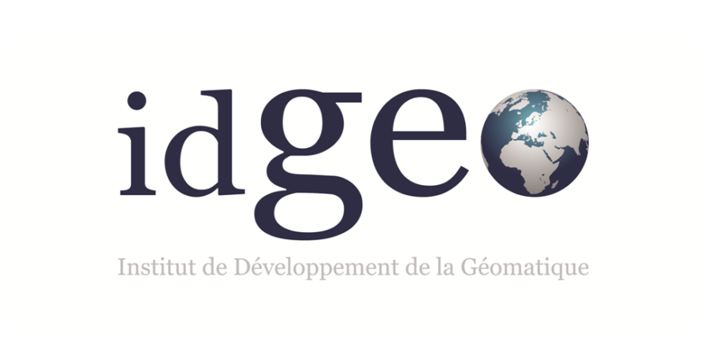

# Ressourcerie / blog IDGEO




```sql
SELECT documentation
FROM idgeo.blog
WHERE post like '%opensource%';
```

Bienvenue dans la ressourcerie d'IDGEO
-------

Une ressourcerie qui mélange des trucs et  des astuces diverses et variées, utiles ou non et surtout agréables, on espère, surtout parce qu'un support de cours à ses limites que la limite franchie rapidement.

Cette ressourcerie est alimentée par la générosité des apprenants d'Idgeo qui nous font souvent aller au delà de ce que nous avions prévu.

### Des améliorations

- [x] gestion des articles en blogs pour ajouter la notion d'archive de date de sortie ou encore d'auteur
- [ ] Ajouter le titre des articles ou listes des articles
    - [x] ajout des videos (avec embed)
    - [x] extra css pour personnaliser au maximum
- [ ] Les bonnes pratiques de la ressourcerie
- [ ] ref biblio (les liens vers les doc officielles)
  
... des idées ?


*Image Générée par le chat qui prout*